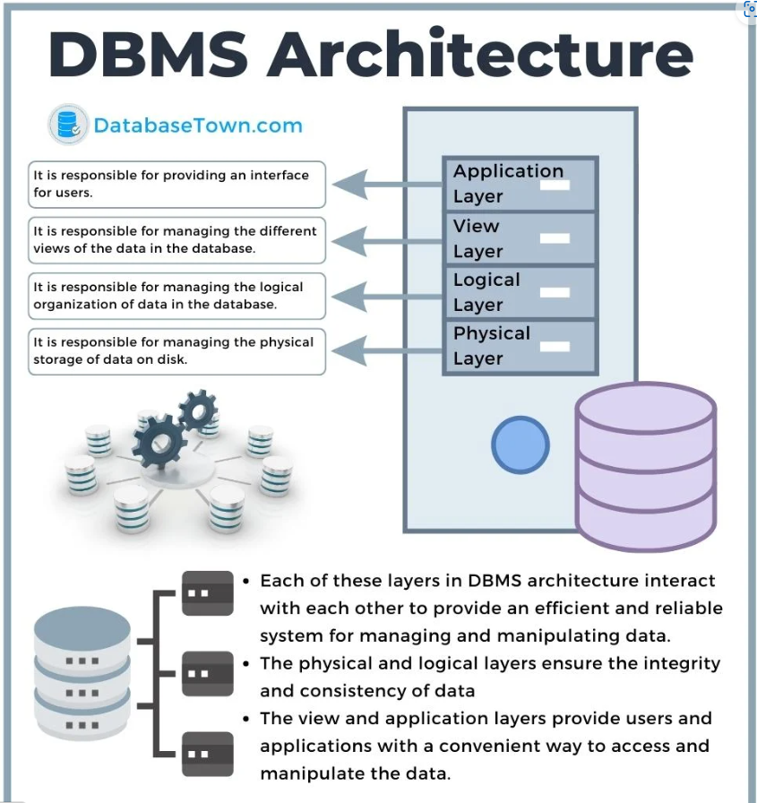

## Comprehensive Answers about Databases and DBMS

### 1. What is DBMS?
A **Database Management System (DBMS)** serves as a bridge between users or applications and the physical data stored in a database. It provides an abstraction layer that shields users from the complexities of managing data at the storage level. DBMS ensures data integrity, security, and efficient management of large datasets. It also offers query optimization, indexing, and transaction management to maintain the reliability of data operations.
## Benefits of Using a DBMS

1. **Data Integrity:** DBMS enforces data consistency and accuracy through defined constraints and rules.

2. **Security:** DBMS offers access control and encryption features to safeguard sensitive data.

3. **Data Sharing:** Multiple users and applications can access the same data concurrently.

4. **Reduced Data Redundancy:** Data normalization techniques minimize redundancy, saving storage space.

5. **Efficient Data Retrieval:** Query optimization ensures quick data retrieval even from large datasets.

6. **Scalability:** Many DBMSs support horizontal and vertical scaling to accommodate growing data needs.

7. **Data Backup and Recovery:** DBMS provides mechanisms for data backup and disaster recovery.

8. **Data Independence:** Changes to the database structure do not affect the application code using the data.

9. **Centralized Management:** DBMS centralizes data management tasks, reducing administrative overhead.

## Core Components of a DBMS

### Data Storage and Organization
DBMS stores data in various formats, often using a combination of files, tables, indexes, and other data structures. The organization of data is crucial for quick and efficient retrieval.

### Data Retrieval and Manipulation
Users can interact with the data stored in the database by using structured query languages (SQL). SQL allows users to retrieve, modify, and delete data as needed.

### Data Security and Access Control
DBMS implements robust security mechanisms to control who can access the data and what actions they can perform. User authentication, authorization, and encryption are common security features.

### Data Integrity and Consistency
DBMS enforces rules and constraints on the data to maintain its accuracy and reliability. It ensures that the data remains consistent even when multiple users access and modify it simultaneously.

### Concurrency Control
When multiple users try to access and modify data simultaneously, the DBMS employs concurrency control mechanisms to prevent conflicts and ensure data consistency.

### Transaction Management
A transaction is a sequence of operations that must be executed together as a single unit. DBMS ensures the "ACID" properties (Atomicity, Consistency, Isolation, Durability) for transactions, which guarantees reliable and predictable results.

### Data Recovery and Backup
DBMS implements mechanisms for data recovery in case of failures such as crashes. It also offers backup and restore functionalities to prevent data loss.

### Query Optimization
The DBMS's query optimizer analyzes SQL queries to determine the most efficient way to retrieve data. It selects appropriate indexes and optimization techniques to speed up query execution.

### Data Dictionary Management
DBMS maintains a data dictionary or metadata repository that contains information about the database's structure, relationships, constraints, and more. This metadata helps in managing and understanding the database schema.

### Data Migration and Transformation
DBMS supports the migration of data from one format or structure to another. It also facilitates data transformation and integration, which is crucial in data warehousing and business intelligence scenarios.

## Types of DBMS

### Relational DBMS (RDBMS)
RDBMS organizes data into structured tables with predefined relationships between them. It uses SQL to manage and query data. Popular RDBMS examples include MySQL, PostgreSQL, Oracle Database, and Microsoft SQL Server.

### NoSQL DBMS
NoSQL databases handle unstructured or semi-structured data and do not rely on fixed schemas. They are suitable for applications requiring high scalability and flexibility. Types of NoSQL databases include document stores, key-value stores, column-family stores, and graph databases.

### Object-Oriented DBMS (OODBMS)
OODBMS stores data as objects, which include both data and behavior. This type of DBMS is useful for applications that model complex real-world entities.

### Graph DBMS
Graph DBMS is designed to handle data organized as nodes and edges in a graph structure. It's particularly suitable for scenarios involving complex relationships and interconnected data.

### In-Memory DBMS
In-memory databases store data in the main memory (RAM) instead of traditional disk storage, enabling faster data retrieval and processing.

### Time-Series DBMS
Time-series databases specialize in handling data that changes over time, such as sensor data, financial data, and IoT data.




### 2. What is a database?
A **database** is a systematically organized collection of data that is designed to be stored, managed, and retrieved efficiently. Databases serve as repositories for various types of information, ranging from simple text to complex multimedia files. They play a vital role in modern information systems by providing a structured and organized way to store and access data.

### Characteristics of Databases:

1. **Data Structure:** Databases store data in a structured format, often using tables, records, and fields. The structure defines the relationships between different pieces of data.

2. **Data Integrity:** Databases enforce rules and constraints to ensure the accuracy and reliability of the stored data. This prevents inconsistent or invalid data from being stored.

3. **Data Independence:** Databases offer a level of separation between the data and the applications that use it. Changes to the database structure don't necessarily affect the application code.

4. **Data Security:** Databases implement security features to control access to data. This includes user authentication, authorization, and encryption to safeguard sensitive information.

5. **Data Sharing:** Databases enable multiple users and applications to access and manipulate the same data simultaneously. Concurrency control mechanisms ensure data consistency in multi-user environments.

6. **Data Retrieval:** Databases provide efficient mechanisms for retrieving data based on specific criteria. Queries can be performed to filter and retrieve relevant information.

### Components of a Database:

1. **Tables:** A database is often organized into tables, each representing a specific type of entity (e.g., customers, orders, products). Tables consist of rows (records) and columns (fields).

2. **Records:** A record is a complete set of information related to a single entity. Each record occupies a row in a table and is made up of data stored in its corresponding columns.

3. **Columns:** Columns represent specific attributes or characteristics of an entity. Each column holds a specific type of data, such as names, dates, or numerical values.

4. **Primary Key:** A primary key uniquely identifies each record in a table. It ensures data integrity by preventing duplicate records and serves as a reference for establishing relationships between tables.

5. **Foreign Key:** A foreign key establishes a relationship between two tables. It refers to the primary key of another table and is used to maintain data consistency and integrity across related tables.

6. **Indexes:** Indexes are data structures that speed up data retrieval by providing quick access paths to specific data in a table. They enhance query performance.

7. **Constraints:** Constraints define rules that restrict the type of data that can be entered into a table. Common constraints include uniqueness, referential integrity, and data validation.

### Types of Databases:

1. **Relational Databases (RDBMS):** These databases use a structured approach with tables, rows, and columns to store and manage data. RDBMSs follow the relational model and use SQL for querying and manipulation. Examples include MySQL, PostgreSQL, and Oracle Database.

2. **NoSQL Databases:** NoSQL databases provide flexible and scalable ways to handle unstructured, semi-structured, and large volumes of data. They include document stores, key-value stores, column-family stores, and graph databases. Examples include MongoDB, Cassandra, and Neo4j.

3. **Object-Oriented Databases (OODBMS):** OODBMS stores data as objects with attributes and behaviors. They are suitable for applications that model complex real-world entities and relationships.

4. **In-Memory Databases:** These databases store data in the main memory (RAM) instead of traditional disk storage, enabling faster data retrieval and processing.

### Advantages of Using Databases:

- **Efficient Data Retrieval:** Databases provide optimized mechanisms for querying and retrieving specific data, even from large datasets.
- **Data Integrity:** Databases enforce rules and constraints to ensure the accuracy and consistency of data.
- **Data Centralization:** Data is stored in a centralized location, promoting data sharing and reducing data redundancy.
- **Security:** Databases implement security features to control access to sensitive information.
- **Scalability:** Many databases can scale horizontally or vertically to accommodate growing data needs.
- **Concurrency Control:** Databases manage multiple users accessing and modifying data simultaneously without conflicts.
- **Data Recovery:** Databases offer mechanisms for data backup and disaster recovery in case of failures.

In essence, databases provide a structured and efficient way to store, manage, and retrieve data, making them essential components of various applications across industries.


### 3. What is RDBMS?
## Relational Database Management System (RDBMS)

A **Relational Database Management System (RDBMS)** is a type of database management system that follows the principles of the relational model for data storage and retrieval. The relational model represents data in the form of tables with rows and columns, and it establishes relationships between tables using keys. RDBMSs use structured query languages (SQL) to manage and manipulate data, making them widely used in various applications that require structured data storage and retrieval.

### Key Concepts of RDBMS:

1. **Tables:** RDBMSs organize data into tables, where each table represents a specific entity (e.g., customers, orders, products). Each row in a table is a record, and each column is a field that stores a specific attribute.

2. **Primary Key:** A primary key uniquely identifies each record within a table. It ensures data integrity by preventing duplicate records and serves as a reference for establishing relationships between tables.

3. **Foreign Key:** A foreign key establishes relationships between tables. It references the primary key of another table and is used to maintain data consistency and integrity across related tables.

4. **Normalization:** RDBMS encourages data normalization, a process that minimizes data redundancy and anomalies by structuring data into separate tables and reducing data duplication.

5. **Structured Query Language (SQL):** SQL is the standard language used to interact with RDBMSs. It provides commands for creating, modifying, and querying databases and their data.

6. **Transactions:** RDBMSs support transactions, which are sequences of operations that are treated as a single unit. The ACID properties (Atomicity, Consistency, Isolation, Durability) ensure reliable and predictable results.

7. **Query Optimization:** RDBMSs include query optimizers that analyze SQL queries and determine the most efficient way to retrieve data. This optimization enhances query performance.

### Advantages of RDBMS:

- **Data Integrity:** RDBMS enforces constraints and rules to ensure data accuracy and reliability.
- **Data Relationships:** RDBMS supports well-defined relationships between tables through primary and foreign keys.
- **Query Flexibility:** SQL allows users to retrieve, filter, and manipulate data in various ways.
- **Data Security:** RDBMSs offer security mechanisms to control access and protect sensitive information.
- **ACID Compliance:** Transactions in RDBMSs adhere to the ACID properties, ensuring data consistency and reliability.
- **Consistency in Data Redundancy:** Normalization reduces data redundancy, leading to consistent and non-repetitive data storage.
- **Standardized Language:** SQL is a standardized language for database operations, making it widely applicable and transferable across systems.

### Examples of RDBMS:

1. **MySQL:** An open-source RDBMS known for its speed, reliability, and ease of use. It's commonly used in web applications.

2. **Oracle Database:** A robust commercial RDBMS with advanced features suitable for large-scale enterprise applications.

3. **Microsoft SQL Server:** A comprehensive RDBMS developed by Microsoft, suitable for various business applications and data warehousing.

4. **PostgreSQL:** An open-source RDBMS known for its extensibility and support for advanced data types.

5. **SQLite:** A self-contained, serverless RDBMS that is embedded within applications, ideal for smaller-scale projects.

6. **IBM Db2:** A family of data management products, including both cloud-based and on-premises RDBMS offerings.

7. **MariaDB:** An open-source RDBMS that is a MySQL fork, designed to be a drop-in replacement with additional enhancements.

RDBMSs are widely used in applications that require structured data storage, efficient querying, and data consistency. Their relational model and SQL capabilities make them a cornerstone of data management in various industries.


### 4. What are database languages?
**Database languages** facilitate communication between users or applications and the underlying database. They provide a structured way to define, manipulate, and retrieve data:

- **DDL (Data Definition Language):** DDL is used to define the structure of the database schema. It includes creating and altering tables, defining constraints, and managing indexes.

- **DML (Data Manipulation Language):** DML enables the manipulation of data within the database. It includes operations like inserting new records, updating existing ones, and deleting records.

- **DCL (Data Control Language):** DCL focuses on access control and security. It allows administrators to grant or revoke permissions to control who can access and modify data.

- **TCL (Transaction Control Language):** TCL manages transactions, ensuring that groups of operations are treated as single units. It includes commands for committing or rolling back transactions.

### 5. DDL (Data Definition Language)

**DDL** is used for defining and managing the structure of the database. It includes commands for creating, altering, and deleting database objects like tables, indexes, and views. DDL is responsible for establishing the schema of the database.

Example DDL commands:

- `CREATE TABLE`: Creates a new table.
- `ALTER TABLE`: Modifies the structure of an existing table.
- `DROP TABLE`: Deletes a table and its data from the database.
- `CREATE INDEX`: Creates an index on one or more columns of a table.
- `CREATE VIEW`: Creates a virtual table derived from other tables.

### 6. DML (Data Manipulation Language)
**DML** focuses on manipulating the data stored in the database. It involves inserting, updating, and deleting records, as well as querying the data to retrieve specific information. DML is used to interact with the data itself.

Example DML commands:

- `SELECT`: Retrieves data from one or more tables.
- `INSERT`: Adds new records to a table.
- `UPDATE`: Modifies existing records in a table.
- `DELETE`: Removes records from a table.
  
### 7. DCL (Data Control Language)
**DCL** DCL is concerned with controlling access to data and database objects. It manages permissions and user access rights to ensure data security and integrity.

Example DCL commands:

- `GRANT`: Provides specific privileges to users or roles.
- `REVOKE`: Removes specific privileges from users or roles.
- `DENY`: Prevents specific actions from being performed by users or roles.


### 8. Query Languages:

In addition to DDL, DML, and DCL, databases often use query languages to retrieve and manipulate data. The most common query language used is Structured Query Language (SQL), which is a standard language for relational databases. SQL allows users to perform a wide range of operations on the data stored in a relational database.

Example SQL queries:

- `SELECT * FROM employees WHERE department = 'HR'`: Retrieves all employees from the HR department.
- `UPDATE products SET price = price * 1.1 WHERE category = 'Electronics'`: Increases the price of electronic products.
- `DELETE FROM orders WHERE status = 'Cancelled'`: Removes cancelled orders from the database.

### Non-SQL Languages:

In recent years, non-SQL databases (NoSQL databases) have gained popularity, leading to the emergence of non-SQL query languages specific to each database type. These languages cater to the unique data models and requirements of NoSQL databases, such as document stores, key-value stores, column-family stores, and graph databases.

### 9. What is Normalization (1NF, 2NF, 3NF)?

**Normalization** is a process in database design that aims to reduce data redundancy, improve data integrity, and ensure efficient data storage and retrieval. It involves organizing data into separate tables and applying certain rules to eliminate undesirable characteristics such as data duplication and anomalies. There are several levels of normalization, with the most common ones being First Normal Form (1NF), Second Normal Form (2NF), and Third Normal Form (3NF).

### 1. First Normal Form (1NF):

In 1NF, each table cell must contain a single, indivisible value, and each column must have a unique name. This level eliminates repeating groups and ensures that each piece of data is atomic.

Example: 
| Student_ID | Subjects          |
|------------|-------------------|
| 101        | Math, Physics     |
| 102        | Chemistry, Biology|


Converting to 1NF:
| Student_ID | Subject  |
|------------|----------|
| 101        | Math     |
| 101        | Physics  |
| 102        | Chemistry|
| 102        | Biology  |


### 2. Second Normal Form (2NF):

A table is in 2NF if it is in 1NF and every non-key attribute is fully functionally dependent on the primary key. This means that data should not be partially dependent on only a part of the primary key.

**Example:**

Original Table:
| Order_ID | Product | Category     |
|----------|---------|--------------|
| 101      | Laptop  | Electronics |
| 101      | Mouse   | Accessories |
| 102      | Mouse   | Accessories |

Converting to 2NF:

arduino
Copy code
| Order_ID | Product | 
|----------|---------|
| 101      | Laptop  |
| 101      | Mouse   |
| 102      | Mouse   |

| Product | Category     |
|---------|--------------|
| Laptop  | Electronics |
| Mouse   | Accessories |
3. Third Normal Form (3NF):
Original Table:

javascript
Copy code
| Student_ID | Course   | Professor |
|------------|----------|------------|
| 101        | Math     | Dr. Smith  |
| 101        | Physics  | Dr. Johnson|
| 102        | Math     | Dr. Smith  |
Converting to 3NF:

javascript
Copy code
| Student_ID | Course   | 
|------------|----------|
| 101        | Math     |
| 101        | Physics  |
| 102        | Math     |

| Course   | Professor |
|----------|------------|
| Math     | Dr. Smith  |
| Physics  | Dr. Johnson|
Feel free to use this markdown code to present the examples for each normalization level.


User
combine the both of above response
ChatGPT
Sure, here's the combined response with both the explanation and examples of normalization levels written in markdown code language:

markdown
Copy code
## Normalization (1NF, 2NF, 3NF)

**Normalization** is a process in database design that aims to reduce data redundancy, improve data integrity, and ensure efficient data storage and retrieval. It involves organizing data into separate tables and applying certain rules to eliminate undesirable characteristics such as data duplication and anomalies. There are several levels of normalization, with the most common ones being First Normal Form (1NF), Second Normal Form (2NF), and Third Normal Form (3NF).

### 1. First Normal Form (1NF):

In 1NF, each table cell must contain a single, indivisible value, and each column must have a unique name. This level eliminates repeating groups and ensures that each piece of data is atomic.

**Example:**

Original Table:
Student_ID	Subjects
101	Math, Physics
102	Chemistry, Biology
css
Copy code

Converting to 1NF:
Student_ID	Subject
101	Math
101	Physics
102	Chemistry
102	Biology
vbnet
Copy code

### 2. Second Normal Form (2NF):

A table is in 2NF if it is in 1NF and every non-key attribute is fully functionally dependent on the primary key. This means that data should not be partially dependent on only a part of the primary key.

**Example:**

Original Table:
| Order_ID | Product | Category     |
|----------|---------|--------------|
| 101      | Laptop  | Electronics |
| 101      | Mouse   | Accessories |
| 102      | Mouse   | Accessories |

Converting to 2NF:
| Order_ID | Product | 
|----------|---------|
| 101      | Laptop  |
| 101      | Mouse   |
| 102      | Mouse   |

| Product | Category     |
|---------|--------------|
| Laptop  | Electronics |
| Mouse   | Accessories |


### 3. Third Normal Form (3NF):

A table is in 3NF if it is in 2NF and no non-key attribute is transitively dependent on the primary key. This means that there should be no transitive dependency between non-key attributes through another non-key attribute.

Example:
Original Table:
| Student_ID | Course   | Professor |
|------------|----------|------------|
| 101        | Math     | Dr. Smith  |
| 101        | Physics  | Dr. Johnson|
| 102        | Math     | Dr. Smith  |

Converting to 3NF:

| Student_ID | Course   | 
|------------|----------|
| 101        | Math     |
| 101        | Physics  |
| 102        | Math     |

| Course   | Professor |
|----------|------------|
| Math     | Dr. Smith  |
| Physics  | Dr. Johnson|


### 10.  What is DeNormalization?

**Denormalization** is a database optimization technique that involves intentionally introducing redundancy into a database's schema. Unlike normalization, which aims to eliminate redundancy and improve data integrity, denormalization is used to improve query performance by reducing the number of joins and simplifying data retrieval. This technique can be particularly useful in situations where read operations significantly outnumber write operations, and the emphasis is on fast data retrieval.

### Reasons for Denormalization:

1. **Query Performance:** By storing redundant data in a single table, complex joins across multiple normalized tables can be avoided, leading to faster query execution.

2. **Reduced Joins:** Denormalization reduces the need for joining multiple tables, which can be resource-intensive and time-consuming.

3. **Aggregation:** Pre-aggregated data can be stored, reducing the need to calculate aggregates on the fly.

4. **Simpler Queries:** Denormalized schemas often lead to simpler and more intuitive queries, improving developer productivity.

5. **Reporting:** For analytical and reporting purposes, denormalization can speed up data retrieval for generating reports.

### Examples of Denormalization:

**Example 1: E-commerce Store**

In a normalized schema, product information might be stored in one table and order information in another. When displaying a list of orders with associated product details, multiple joins are needed. Denormalization involves storing product information directly within the order table, reducing joins and enhancing query speed.

**Example 2: Social Media**

In a normalized schema, user profiles and posts might be stored in separate tables. To display a user's recent posts along with their profile information, joins are required. Denormalization could involve storing a user's profile details within each post, simplifying queries for displaying post data.

### Considerations and Trade-offs:

While denormalization can significantly improve query performance, it also introduces redundancy, which can lead to data integrity issues if not managed properly. Redundant data needs to be carefully synchronized during updates to maintain consistency. Additionally, denormalized databases might require more storage space due to redundant data.

### Use Cases:

- **Data Warehousing:** Denormalization is often used in data warehousing scenarios, where optimizing query performance for reporting and analysis is crucial.

- **Caching:** Caching frequently accessed data in a denormalized format can reduce the load on the database and improve application performance.

- **Read-Heavy Applications:** Applications with a high read-to-write ratio can benefit from denormalization to minimize query complexity.

In summary, denormalization is a technique used to optimize query performance by intentionally introducing redundancy into a database's schema. While it can greatly enhance data retrieval speed, careful consideration and maintenance are required to manage data consistency and integrity.

### 11. Atomicity

**Atomicity** is one of the fundamental properties of a database transaction. It ensures that a transaction is treated as a single, indivisible unit of work, meaning that either all of its operations are executed successfully, or none of them are executed at all. In other words, atomicity guarantees that if any part of a transaction fails, the entire transaction is rolled back to its initial state, leaving the database unaffected by partial changes.

### Characteristics of Atomicity:

1. **All-or-Nothing Rule:** Atomicity enforces the principle that a transaction must be executed in its entirety or not at all. There is no intermediate state where some parts of the transaction are applied while others are not.

2. **Isolation:** During the execution of a transaction, its changes are not visible to other transactions until the transaction is successfully completed. This ensures that other transactions are isolated from the intermediate states of an ongoing transaction.

### Example:

Consider a banking application where a customer transfers funds from one account to another. The transaction involves deducting the amount from one account and adding it to another. In an atomic transaction:

- If the deduction succeeds but the addition fails, the entire transaction is rolled back, and neither account is affected.
- If the addition succeeds but the deduction fails, the entire transaction is rolled back, and neither account is affected.
- Only if both operations (deduction and addition) are successful, the transaction is committed, and the changes become permanent.

### Importance of Atomicity:

1. **Data Consistency:** Atomicity ensures that the database remains in a consistent state even if a transaction fails. Partially completed transactions cannot leave the database in an inconsistent or erroneous state.

2. **Fault Tolerance:** In the event of a system crash, atomicity guarantees that only complete transactions are stored in the database, preventing incomplete, erroneous, or corrupted data.

3. **Concurrent Execution:** In a multi-user environment, atomicity allows multiple transactions to be executed concurrently without causing conflicts or inconsistencies.


### 12. What is ACID?

**ACID** is an acronym that represents a set of properties that ensure the reliability and consistency of database transactions, particularly in the context of relational database management systems (RDBMS). ACID stands for Atomicity, Consistency, Isolation, and Durability, and these properties collectively define the characteristics of a well-behaved and dependable database system.

### The ACID Properties:

1. **Atomicity:** As previously explained, atomicity ensures that a transaction is treated as an indivisible unit of work. All operations within a transaction are either fully completed or fully rolled back. If any part of a transaction fails, the entire transaction is aborted, and the database remains unaffected by partial changes.

2. **Consistency:** Consistency guarantees that a transaction brings the database from one valid state to another. In other words, a transaction should not violate any integrity constraints or rules defined for the database. The database should always be in a consistent state before and after a transaction.

3. **Isolation:** Isolation ensures that the execution of multiple transactions concurrently does not lead to interference or conflicts. Each transaction is isolated from others, and the effects of one transaction are not visible to other transactions until the transaction is completed. This prevents unintended interactions between transactions.

4. **Durability:** Durability ensures that once a transaction is committed and considered successful, its changes are permanent and will survive system failures, crashes, or power outages. Committed data should not be lost or undone, even in the face of catastrophic events.

### Importance of ACID:

The ACID properties are essential for maintaining data integrity, ensuring reliable transactions, and protecting the database from errors and failures. These properties are particularly crucial in scenarios where data accuracy and consistency are of utmost importance, such as financial systems, e-commerce platforms, healthcare databases, and more.

### Use Cases:

ACID properties are particularly relevant in scenarios where the following factors are critical:

- **Data Integrity:** Databases that store sensitive or critical data require strong guarantees of data integrity to prevent unauthorized or erroneous changes.

- **Reliability:** Systems where successful completion of transactions is vital, such as online transactions or financial systems.

- **Concurrent Access:** In multi-user environments, ensuring that transactions can execute concurrently without interfering with each other is crucial.

### Trade-offs:

While ACID properties offer strong guarantees of data consistency and reliability, they can sometimes impact performance, especially in high-concurrency scenarios. In some cases, relaxing certain ACID properties (e.g., allowing eventual consistency in distributed systems) might be considered to improve performance or scalability.

In summary, the ACID properties provide a foundation for building robust and reliable database systems by ensuring that transactions are executed consistently, securely, and without interference, even in the presence of failures or concurrent operations.


### 13. What is a join?
## Join

In the context of databases, a **join** is an operation that combines rows from two or more tables based on a related column between them. Joining tables allows you to retrieve data from multiple tables in a single result set, enabling more complex and meaningful queries by leveraging relationships between the tables.

### Types of Joins:

1. **Inner Join:** This type of join returns only the rows where there is a match between the specified columns in both tables. Rows that don't have a match are excluded from the result set.

2. **Left Join (Left Outer Join):** A left join returns all the rows from the left table and the matching rows from the right table. If there is no match, null values are included for the columns from the right table.

3. **Right Join (Right Outer Join):** Similar to the left join, a right join returns all the rows from the right table and the matching rows from the left table. If there is no match, null values are included for the columns from the left table.

4. **Full Outer Join:** A full outer join returns all rows from both tables, including unmatched rows. If there is no match for a particular row in either table, null values are included for the columns from the non-matching table.

5. **Self Join:** A self join involves joining a table with itself. It's useful when a table contains hierarchical or related data that needs to be compared within the same table.

### Example:

Consider two tables: "Customers" and "Orders." You can use a join operation to retrieve information about customers and their associated orders.

```sql
SELECT Customers.CustomerName, Orders.OrderDate
FROM Customers
INNER JOIN Orders ON Customers.CustomerID = Orders.CustomerID;

